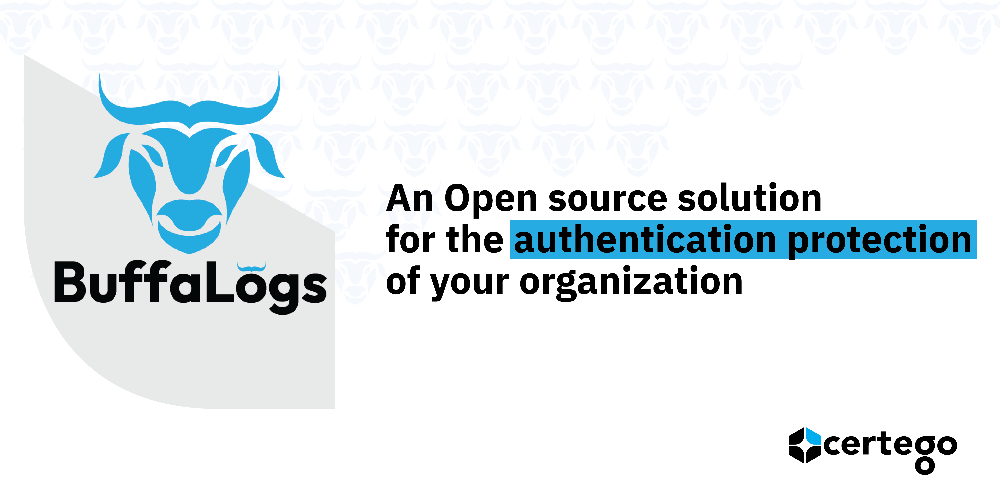
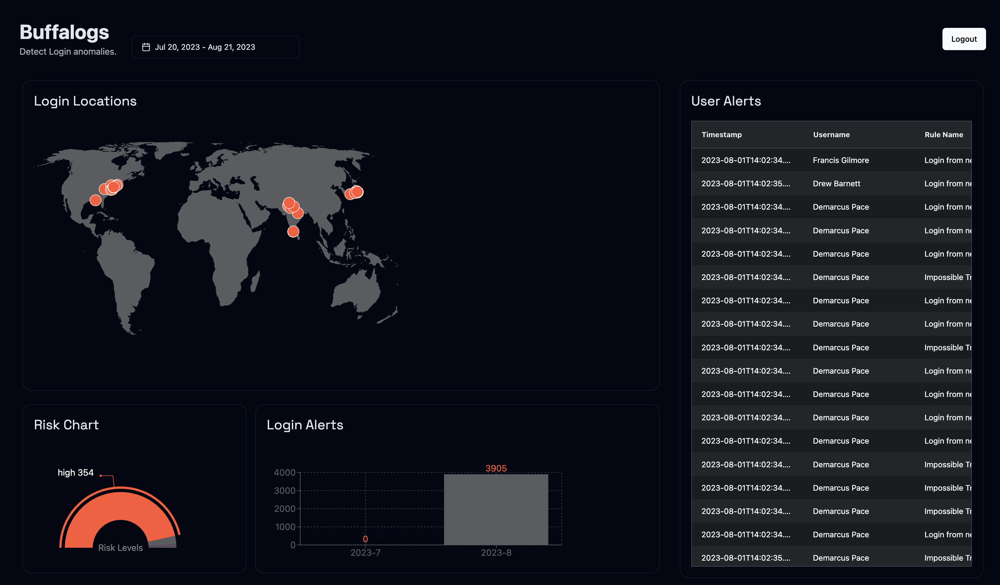

BuffaLogs is an Open Source Django Project whose main purpose is to detect anomalous logins.

In detail, it sends several types of alerts:
1.  **Impossible Travel**

    It occurs when a user logs into the system from a significant distance within a range of time that cannot be covered by conventional means of transport.

2.  **Login from new device**

    This alert is sent if the user utilizes a new appliance.

3.  **Login from a new country**

    This alert is dispatched if the system is logged by a user from a country where they have never authenticated before.

4. **Atypical country**

   This type of alert is triggered when the country from which the user logged in is not new, but unusual because not recent.

5. **User risk threshold**

   This alert is triggered every time that the risk_score of a user increases.

6. **Anonymous IP Login**

   This alert occurs to signal a login made with an anonymous IP.

7. **Stale account**

   The idea is to compare the logins provided by the internal authentication service of the company with the logins collected by BuffaLogs and alert in case of significant inconsistencies.

*For further details: [About](docs/guides/development/complete_guide_for_developers.md)*

## BuffaLogs is participating in FOSDEM 2025 Conference!

[FOSDEM](https://fosdem.org/) is a free event for software developers to meet, share ideas and collaborate. Every year, thousands of developers of free and open source software from all over the world gather at the event in Brussels.

| FOSDEM | An overview on detecting Login Anomalies with BuffaLogs |
|------|-----|
| | [Our Talk:](https://fosdem.org/2025/schedule/event/fosdem-2025-5623-an-overview-on-detecting-login-anomalies-with-buffalogs/) The infosec industry has seen a big growth in recent years, with a plethora of mostly closed-source solutions such as Endpoint Detection and Response (EDR), Security Information and Event Management (SIEM), and Security Orchestration, Automation, and Response (SOAR) marketed as indispensable tools for defending organizations. These solutions often emphasize protection against sophisticated adversaries, zero-day exploits, and malicious insiders. However, our real-world experience reveals that the majority of initial compromises occur through simpler approaches, such as stolen credentials and phishing attacks. In this talk, we introduce Buffalogs, an open-source solution designed to detect and alert on anomalous login behaviors. Adhering to the Unix philosophy of "do one thing and do it well," Buffalogs offers a way to analyze common application logs (ssh, Apache, Microsoft Entra ID, etc) and detect credential misuse. Attendees will gain insights into the challenges of login anomaly detection, the development of Buffalogs and the differences between our solution and other commercial alternatives. |


## BuffaLogs is participating in GSoC 2025 thanks to Honeynet project and IntelOwl!

| Honeynet | IntelOwl|
|------|-----|
|<a href="https://www.honeynet.org">  </a> | <a href="https://github.com/intelowlproject/IntelOwl/blob/master/README.md"> </a> |

### Google Summer Of Code

Timeline: https://developers.google.com/open-source/gsoc/timeline
Honeynet projects ideas: https://www.honeynet.org/gsoc/gsoc-2025/google-summer-of-code-2025-project-ideas/ 

Official Discord chat: https://discord.gg/68B8Ru5fSU

##  Installation & Running
BuffaLogs employs the following tools which have to be installed on the machine:
- [Docker](https://docs.docker.com/install/linux/docker-ce/ubuntu/)
- [Docker-compose](https://docs.docker.com/compose/install/)
- [Python](https://www.python.org/downloads/)

Then, you can clone this repository on your local computer with:

```bash
git clone git@github.com:certego/BuffaLogs.git
```
Or download the application directly from the [Docker Hub](https://hub.docker.com/r/certego/buffalogs), with the `sudo docker pull certego/buffalogs:<release_tag>`.

After that, there are two ways of running BuffaLogs, depending on your system configurations:
* if you already have an elastic cluster:
    *  set the address of the host into the `CERTEGO_ELASTICSEARCH` variable in the `buffalogs.env` file
    *  launch ` docker compose up -d` to run the containers
* if you have no hosts with Elasticsearch installed on it, you can run it directly with Buffalogs:
    * run `docker compose -f docker-compose.yaml -f docker-compose.elastic.yaml up -d` in order to execute all the containers, included Elasticsearch and Kibana
    * Now elasticsearch and kibana are running on the same host with Buffalogs.



*For further examples: [Example](docs/guides/development/step_by_step_example.md)*

##  Uninstall

To uninstall and remove all files, delete all containers with:
```
sudo docker-compose down -v
```
Then you can safely delete this repository.

## Release
1. If needed, update the requirements in the `requirements.txt` and also into the `setup.cfg` file
2. Add a new entry in `CHANGELOG.md` containing all the features, changes and bugfix developed
3. Modify the **version** in the `setup.cfg`
4. Remove the previous version of the reusable app into `django-buffalogs/dist` and create the new version running `python3 setup.py sdist` from `django-buffalogs/`
5. Commit a PR from the develop to the main branch with the version as a Title and the changes as a comment
6. Now you can export BuffaLogs copying the `buffalogs-x.y.z.tar.gz` package into your project

## Licence
This project is protected by the Apache Licence 2.0.

##  Contribution
BuffaLogs is an Open Source project and was developed in order to allow enrichments from people with any level of experience, but please read carefully the [Contribution guidelines](CONTRIBUTING.md) before making any changes to the project.

## Authors and Maintainers
- [Federico Foschini](https://github.com/ManofWax) – Administrator, Software Architect, and Code Reviewer
- [Lorena Goldoni](https://github.com/Lorygold) – Lead Author, Principal Maintainer, and Code Reviewer
- [Abheek Tripathy](https://github.com/abheektripathy) – Google Summer of Code 2024 contributor
- [Onunwa Goodness](https://github.com/Noble-47) – Google Summer of Code 2025 contributor
- [Kunal Gurtatta](https://github.com/kunalsz) – Google Summer of Code 2025 contributor

[def]: docs/
